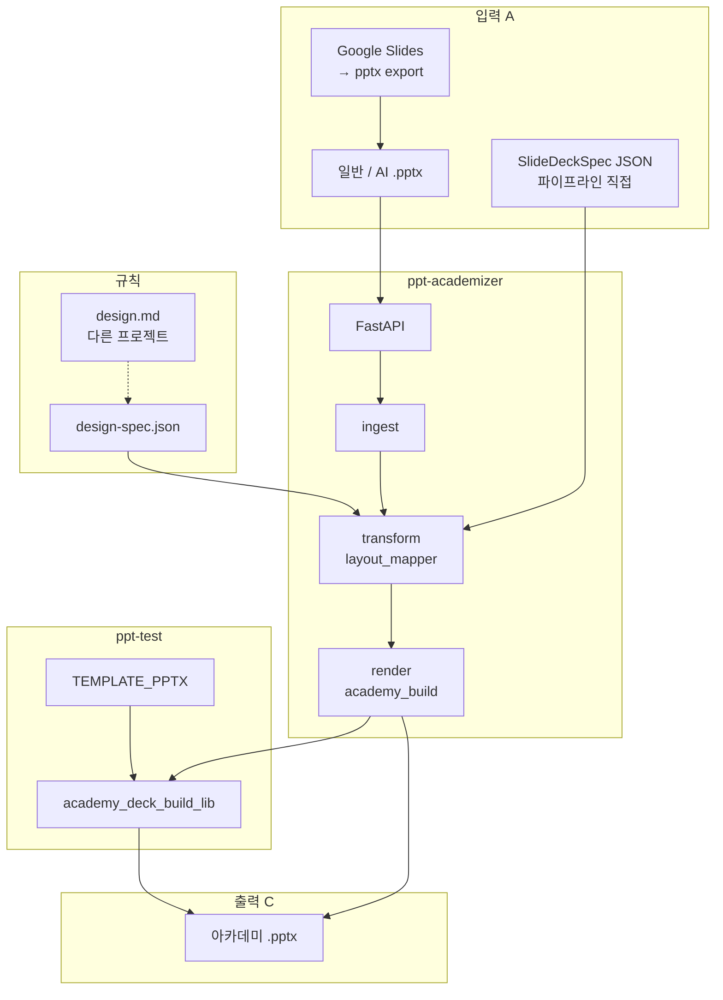
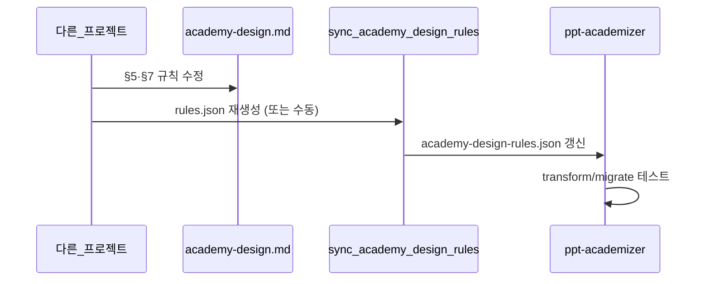

# ppt-academizer — 상세 계획서

| 항목 | 내용 |
|------|------|
| **문서 버전** | 0.3 (`academy-design.md` 변환 로직 반영) |
| **변환 규칙 정본** | [academy-design.md](../../academy-design.md) (monorepo 루트) |
| **프로젝트** | `apps/ppt-academizer` |
| **한글명** | PPT 아카데미화 |
| **영문 의미** | PPT + **academize** (아카데미 강의안 스타일로 변환) |
| **상태** | **MVP 운영** (웹 UI·API·`engine/` 번들, spec + migrate_cmp; PLAN 체크리스트는 부분 반영) |

---

## 제품 UX (최종 검토 — 사용자 이해와의 대응)

**한 줄:** 구글 번역처럼 **원본 넣기 → [아카데미화] → 새 PowerPoint 받기**.

```text
┌─────────────────────────────────────────────────────────┐
│  PPT 아카데미화                                          │
│  ┌─────────────────────────────────────────────────┐   │
│  │  파일 끌어놓기  (.pptx)  [또는 JSON 고급 입력]      │   │
│  └─────────────────────────────────────────────────┘   │
│  표지 제목 [________]  부제 [________]  (선택)          │
│                                                         │
│              [  아카데미화  ]  ← 변환 버튼               │
│                                                         │
│  ⚠ 슬라이드 3: 레이아웃 추정 (warnings)                  │
└─────────────────────────────────────────────────────────┘
                        │
                        ▼
              academy-제목-20260519-143022.pptx
              (브라우저 «다른 이름으로 저장» 또는 지정 폴더)
```

| 사용자 기대 | 계획 반영 | 비고 |
|-------------|-----------|------|
| **웹**에서 사용 | **예** — FastAPI + 단순 웹 페이지(또는 내부 포털) | MVP는 API 먼저, UI는 얇은 업로드 폼 1장 |
| **원본 파일** 입력 | **예** — `.pptx` 업로드 (1차 핵심) | Google Slides는 **pptx로 받아서** 업로드 |
| **텍스트만** 입력 | **2단계** | 1차는 파일; 텍스트→슬라이드는 **강의자료 생성 프로젝트** JSON 또는 후속 |
| **변환 버튼** 한 번 | **예** — `POST /academize` | 서버가 B 전체 실행 |
| **새 PowerPoint** 생성 | **예** — 아카데미 2026 템플릿 적용 `.pptx` | |
| **원하는 위치에 저장** | **부분** — see below | |

### «원하는 위치에 저장» — MVP vs 이후

| 방식 | MVP (1차) | 이후 |
|------|-----------|------|
| **브라우저 다운로드** | **예** — `Content-Disposition: attachment` → 사용자가 Downloads 등에 저장 | 구글 번역과 동일 |
| **서버 폴더 경로 지정** (예: OneDrive 경로) | 아니오 | LAN 에이전트·`output_path` API 옵션 검토 |
| **「다른 이름으로 저장」 대화상자** | 브라우저가 처리 | 웹앱이 File System Access API 쓰면 Chrome 등에서 폴더 선택 가능 (선택) |

**정리:** “구글 번역처럼” = **업로드 → 변환 → 내 PC에 pptx 저장** 까지가 1차 목표입니다.  
서버가 사용자 OneDrive 안에 **직접** 쓰는 기능은 1차 범위 밖입니다.

### 변환 버튼 누르면 서버 안에서 일어나는 일 (B)

1. **읽기** — pptx (텍스트 도형 / Google 배경 이미지 슬라이드 구분)  
2. **판단** — [academy-design.md](../../academy-design.md) §5 레이아웃  
3. **조립** — 아카데미 템플릿 + `save_academy_deck` (§6.2·6.3)  
4. **응답** — 새 `.pptx` 파일 + (선택) warnings JSON  

**이미 검증된 것 (스모크):** spec 빌드, Google 이미지 슬라이드(`apple-history.pptx`), §6.3 슬라이드 뷰.  
**완료:** 웹 UI, `POST /academize`·`/wizard/preview`, migrate_cmp(§7) 파트너 덱.  
**완료 (v1.5.0):** Markdown·텍스트 파일·붙여넣기 → spec.  
**아직:** PDF(Phase 2), CMP radial 연결선, PLAN §21 체크리스트 전면 갱신.

---

## 목차

1. [배경과 문제](#1-배경과-문제)
2. [목표 / 하지 않을 것](#2-목표--하지-않을-것)
3. [사용자와 시나리오](#3-사용자와-시나리오)
4. [시스템 전체 그림](#4-시스템-전체-그림)
5. [입력 A · 변환 B · 출력 C](#5-입력-a--변환-b--출력-c)
6. [academy-design.md 역할](#6-academy-designmd-역할)
7. [ppt-test와 역할 분리](#7-ppt-test와-역할-분리)
8. [데이터 모델](#8-데이터-모델)
9. [레이아웃 판단 규칙 (transform)](#9-레이아웃-판단-규칙-transform)
10. [조립 (render)](#10-조립-render)
11. [HTTP API 명세](#11-http-api-명세)
12. [단계별 구현·완료 기준](#12-단계별-구현완료-기준)
13. [폴더·파일 구조](#13-폴더파일-구조)
14. [환경 변수·설정](#14-환경-변수설정)
15. [경고(warnings)·에러](#15-경고warnings에러)
16. [보안·제한](#16-보안제한)
17. [테스트 전략](#17-테스트-전략)
18. [배포·실행](#18-배포실행)
19. [리스크](#19-리스크)
20. [미결정 사항](#20-미결정-사항)
21. [체크리스트](#21-체크리스트)
22. [참고 문서](#22-참고-문서)
23. [변환 로직 B — academy-design.md 정본](#23-변환-로직-b--academy-designmd-정본)
24. [B 구현 로드맵 (추가)](#24-b-구현-로드맵-추가)

---

## 1. 배경과 문제

### 1.1 하려는 일

교육·강의 담당자가 **제미나이·ChatGPT 등 범용 AI**로 초안을 만듭니다.

- Google Slides 또는 PowerPoint로 export
- 디자인은 AI 기본 테마·자유 배치

회사 납품·아카데미 강의에는 **「1.아카데미 강의안 템플릿(2026)」** 스타일이 필요합니다.

**ppt-academizer** = 그 초안을 **아카데미 템플릿이 적용된 .pptx** 로 바꿔 주는 서비스.

### 1.2 지금까지 실패한 이유 (교훈)

| 시도 | 문제 |
|------|------|
| 엉망인 파트너 PPT → 휴리스틱 즉시 변환 | 제목/본문이 **칸이 아니라 텍스트 상자** → 역할 추측 실패 |
| ppt-test 안에 API까지 넣기 | `build_*`, 실험 스크립트와 **섞여 유지보수 어려움** |
| 변환 결과만 PowerPoint에서 수정 | **처음부터 구조화된 입력**이 더 싸다 |

### 1.3 이 서비스의 위치

```
[범용 AI] → 초안 PPT (A)
                ↓
         [ppt-academizer] (B: academy-design.md 규칙)
                ↓
         아카데미 템플릿 PPT (C)
```

**[academy-design.md](../../academy-design.md)** 는 다른 프로젝트에서 계속 다듬고, ppt-academizer는 그 문서의 **§5·§6·§7** 을 코드로 **실행**합니다.  
(루트 [design.md](../../design.md) 는 브랜드 일반 가이드; 아카데미 PPT 변환은 **academy-design.md만** 본다.)

---

## 2. 목표 / 하지 않을 것

### 2.1 목표 (Must)

| # | 목표 |
|---|------|
| G1 | `.pptx` 업로드 한 번으로 아카데미 레이아웃·테마가 적용된 **C** 생성 |
| G2 | 변환 규칙의 기준을 **[academy-design.md](../../academy-design.md)** 및 `academy-design-rules.json`에 고정 |
| G3 | 완벽하지 않은 슬라이드는 **`warnings`** 로 번호·이유 전달 |
| G4 | **ppt-test** 조립 엔진 재사용 (복사 없이 import) |
| G5 | HTTP API로 팀 LAN·내부 도구에서 호출 가능 |

### 2.2 목표 (Should, 후속)

| # | 목표 |
|---|------|
| S1 | Google Slides 연동 (1차: pptx 다운로드 안내) |
| S2 | 슬라이드 내 **이미지** 아카데미 칸으로 이전 |
| S3 | 규칙으로 안 되는 장만 **LLM** 보조 (academy-design §5 요약 + 슬라이드 텍스트) |
| S4 | `POST /analyze` — 변환 없이 JSON 초안 + audit만 반환 |

### 2.3 하지 않을 것 (Won't, 1차)

| # | 제외 |
|---|------|
| W1 | AI 초안 **100% 무인 완벽** 변환 보장 |
| W2 | academy-design.md **편집 UI** (다른 프로젝트 담당) |
| W3 | ppt-test 안에 API·ingest 코드 추가 |
| W4 | 구글 슬라이드 **실시간 편집** 연동 |
| W5 | cloud-chatbot과 코드베이스 합치기 |

---

## 3. 사용자와 시나리오

### 3.1 사용자

| 역할 | 하는 일 |
|------|---------|
| **강의 담당 / 강사** | AI로 초안 → academize → PowerPoint에서 마무리 |
| **교육 기획** | 파일럿 덱·파트너 자료 일괄 변환 |
| **개발 (다른 프로젝트)** | design.md 개선 → 변환 품질 상승 |
| **내부 자동화** | 강의자료 생성 파이프라인 마지막 단계에서 API 호출 |

### 3.2 시나리오

**UC-1: 제미나이 PPT 변환 (핵심)**

1. 제미나이에서 강의안 생성 → `.pptx` 저장  
2. `POST /academize` 업로드  
3. `academy-과정명-20260518-143022.pptx` 다운로드  
4. 응답 헤더 또는 JSON에 `warnings` 확인  
5. PowerPoint에서 경고 난 슬라이드만 수정  

**UC-2: 변환 전 구조 확인**

1. `POST /analyze` 업로드  
2. 슬라이드별 제안 `layout`, 추출 텍스트, audit(자유 도형 수) 수신  
3. 필요 시 JSON 수정 후 `POST /academize` with JSON body (2단계 API)  

**UC-3: 강의자료 생성 파이프라인 연동 (미래)**

1. 다른 프로젝트가 `SlideDeckSpec` JSON 생성  
2. academize API에 JSON POST → C 즉시 생성 (ingest 생략)  

---

## 4. 시스템 전체 그림



---

## 5. 입력 A · 변환 B · 출력 C

### 5.1 A — 입력

| 형식 | 1차 지원 | 비고 |
|------|----------|------|
| PowerPoint `.pptx` | **예** | AI export, 구글 슬라이드 “Microsoft PPT” 다운로드 |
| Google Slides 네이티브 | 아니오 (1차) | API 키·OAuth 후순위 |
| `SlideDeckSpec` JSON | **예 (2단계)** | ingest 건너뜀 |

**입력 품질 기대**

- 슬라이드당 텍스트가 1~N개 텍스트 상자에 있어도 됨  
- 아카데미 레이아웃이 **아닐 것**이 정상  
- 16:9 권장; 다른 비율이면 경고 후 그대로 ingest

### 5.2 B — 아카데미화 (이 프로젝트)

**academy-design.md** 에 따라 B는 **두 가지 엔진**을 둡니다. API는 `mode` 로 선택 (기본값은 §23.2 참고).

| mode | 이름 | academy-design 근거 | 언제 쓰나 |
|------|------|---------------------|-----------|
| `spec` | 스펙 빌드 | §5 JSON `texts` 매핑 | 구조가 단순·텍스트 위주 |
| `migrate` | 소스 덱 마이그레이션 | **§7** 시드 복제 + 도형 이식 | **AI/Google pptx (기본 권장)** |

공통 마무리: §6.2 `polish_academy_presentation` · §6.3 `save_academy_deck` (항상).

| 단계 | `spec` 모드 | `migrate` 모드 |
|------|-------------|----------------|
| B1 | `ingest` → `RawSlide` | 소스 `Presentation` 슬라이드 순회 |
| B2 | `classify` (§5 레이아웃) | 동일 + 시드 레이아웃 매칭 |
| B3 | `map` → `SlideDeckSpec` | `duplicate_slide_from_seed` + 본문 도형 이식 |
| B4 | `build_from_json_specs` | 슬라이드별 조립 + Google/색/2단 처리 |
| B5 | `save_academy_deck` | 동일 |
| B6 | `api` | HTTP ↔ 파일, `warnings` |

### 5.3 C — 출력

| 항목 | 내용 |
|------|------|
| 파일 | `.pptx` |
| 템플릿 | `1.아카데미 강의안 템플릿(2026).pptx` (academy-design.md §1) |
| 저장 | `save_academy_deck` — 제목 polish + `lastView=sldView` (§6.3) |
| 파일명 | academy-design.md §6.4 (`academy-{stem}-{timestamp}.pptx`) |
| 레이아웃 | `2_표지`, `목차`, `간지`, `내지_거버닝 O`, `1_내지_거버닝 X` 등 |
| 편집성 | PowerPoint에서 **placeholder(칸)** 기준 수정 가능해야 함 |
| 파일명 | `academy-{stem}-{YYYYMMDD-HHMMSS}.pptx` (덮어쓰기 기본 없음) |

---

## 6. academy-design.md 역할

### 6.1 문서 계층

| 문서 | 역할 |
|------|------|
| **[academy-design.md](../../academy-design.md)** | **변환 로직 B의 유일한 정본** — 레이아웃, JSON 매핑, 자동화, §7 마이그레이션 |
| [design.md](../../design.md) | OKESTRO 브랜드·일반 문서; 아카데미 상세는 academy-design로 이전됨 |
| [academy-text-placement-notes.md](../ppt-test/docs/academy-text-placement-notes.md) | ph10/12/13 좌표 보조 |

### 6.2 역할 분담

| 담당 | 산출 | 소비자 |
|------|------|--------|
| **다른 프로젝트** | `academy-design.md` 작성·개정 (특히 §7, 실습 슬라이드 규칙) | 사람, LLM, ppt-academizer |
| **ppt-academizer** | §5·§6·§7 **실행 코드** + HTTP API | 강의 담당, AI 초안 파이프라인 |
| **ppt-test** | `academy_deck_build_lib` · `polish_academy_deck.py` | academizer `render` / `migrate` |

### 6.3 academy-design.md 절 → 코드 매핑

| 절 | 내용 | ppt-academizer 모듈 |
|----|------|---------------------|
| §1 | 템플릿 경로 | `core/config` · ppt-test `academy_template` |
| §2 | 캔버스 16:9 | ingest 검사 → `warnings.ASPECT_RATIO` |
| §3 | 테마 색 dk1/dk2/accent | `migrate` 본문 색 매핑 |
| §4 | 글꼴 | render 후 육안; placeholder 우선 |
| §5 | 레이아웃 + **`texts` 순서** | `transform` 화이트리스트 · `spec` 모드 |
| §6.1 | 본문 `\n` / word_wrap | ingest 후처리 · warnings |
| §6.2 | ph10 제목 18pt 등 | `polish_academy_presentation` (ppt-test) |
| §6.3 | `sldView` 저장 | `save_academy_deck` (필수) |
| §6.4 | 출력 파일명 | API `Content-Disposition` |
| **§7** | **소스 덱 마이그레이션** | **`transform/migrate_from_source.py` (신규)** |

### 6.4 `academy-design-rules.json` (기계용 스냅샷)

사람은 `academy-design.md`만 편집하고, 서버는 JSON 스냅샷을 읽습니다.

```bash
# 1차: extract_design_spec (캔버스·레이아웃 이름)
cd apps/ppt-test && export TEMPLATE_PPTX="…"
.venv/bin/python scripts/extract_design_spec.py > ../ppt-academizer/docs/design-spec.json

# 2차 (추가 예정): academy-design §5 texts 슬롯·§3 HEX·§6.2 상수
# ../ppt-academizer/scripts/sync_academy_design_rules.py
# → docs/academy-design-rules.json
```

| 파일 | 출처 |
|------|------|
| `docs/design-spec.json` | 템플릿 PPTX + extract |
| `docs/academy-design-rules.json` | academy-design.md §3·§5·§6 (수동 또는 sync 스크립트) |

`ACADEMY_DESIGN_MD` 환경변수로 md 경로 지정 가능 (기본: repo 루트 `academy-design.md`).

---

## 7. ppt-test와 역할 분리

### 7.1 왜 폴더를 나누는가

| ppt-test | ppt-academizer |
|----------|----------------|
| 조립 엔진·CLI·샘플 JSON | **서비스** (HTTP, ingest, transform) |
| PaaS 변환 실험, `convert_legacy_*` | 프로덕션 경로만 |
| `.cursor/skills` | `api/`, `tests/` |

### 7.2 재사용 목록 (import, 복사 금지)

| ppt-test 경로 | 용도 |
|---------------|------|
| [scripts/academy_deck_build_lib.py](../ppt-test/scripts/academy_deck_build_lib.py) | `build_from_json_specs`, `duplicate_slide_from_seed`, `fill_slide_from_spec`, `polish_academy_presentation`, `save_academy_deck`, `assign_content_slide_title` |
| [scripts/polish_academy_deck.py](../ppt-test/scripts/polish_academy_deck.py) | 기존 덱만 §6.2–6.3 후처리 (CLI) |
| [scripts/academy_template.py](../ppt-test/scripts/academy_template.py) | 템플릿 경로 resolve |
| [scripts/post_save_validate.py](../ppt-test/scripts/post_save_validate.py) | (선택) 저장 후 검증 |
| [scripts/extract_design_spec.py](../ppt-test/scripts/extract_design_spec.py) | design-spec 생성 (개발 시) |

### 7.3 연결 방식 (구현 시)

```text
PYTHONPATH=../ppt-test:.
# 또는 pyproject.toml [tool.uv.sources] path = "../ppt-test"
```

`ppt-test`의 `build_academy_deck.py`, `convert_legacy_*`는 **호출하지 않음**.

### 7.4 폴더 정리

- `apps/academy-rahabyeon/` — **삭제 예정** (가칭). 구현 시작 시 제거하고 `ppt-academizer`만 유지.

---

## 8. 데이터 모델

### 8.1 ingest 결과 — `RawSlide`

```python
# 개념 모델 (구현 시 Pydantic)
RawSlide(
  index: int,              # 0-based
  texts: list[TextBlock], # top, left, text, char_count
  images: list[ImageBlock],# blob path or bytes ref
  notes: str | None,
  source_layout_name: str | None,  # 원본 레이아웃 이름
)
TextBlock(top_in: float, left_in: float, text: str)
```

### 8.2 변환 결과 — `AcademySlideSpec` (ppt-test JSON과 동일)

[build_academy_deck.py](../ppt-test/build_academy_deck.py) 독스트링과 **호환**:

```json
{
  "layout": "내지_거버닝 O",
  "texts": ["슬라이드 제목", "짧은 띠", "본문"],
  "placeholders": { "10": "…" },
  "images": [{ "idx": 11, "path": "/tmp/…/img1.png" }],
  "shapes": []
}
```

### 8.3 덱 단위 — `SlideDeckSpec`

```json
{
  "version": "1",
  "meta": {
    "title": "과정명",
    "subtitle": "부제",
    "source_filename": "gemini-draft.pptx"
  },
  "slides": [ /* AcademySlideSpec[] */ ]
}
```

### 8.4 API 응답 메타 — `AcademizeResult`

```json
{
  "ok": true,
  "output_filename": "academy-gemini-draft-20260518-143022.pptx",
  "slide_count": 24,
  "warnings": [
    { "slide": 3, "code": "LAYOUT_GUESS", "message": "간지로 추정함" },
    { "slide": 7, "code": "IMAGE_SKIP", "message": "이미지 미이전" }
  ],
  "spec_preview_url": null
}
```

---

## 9. 레이아웃 판단 규칙 (transform)

### 9.1 서비스가 쓰는 레이아웃 (1차 화이트리스트)

| layout | texts 개수 | 용도 |
|--------|------------|------|
| `2_표지` | 1 | 덱 첫 장 (또는 meta로 표지 삽입) |
| `목차` | 1 | 목차 블록 |
| `간지` | 2 | 챕터 제목, 번호 `1.` |
| `내지_거버닝 O` | 3 | 제목, 띠(ph12), 본문(ph13) |
| `1_내지_거버닝 X` | 2 | 제목, 긴 본문(ph12) |
| `내지_참고` | (후순위) | 부록 |

`3_표지`~`6_표지` 등은 **1차 미사용** (design.md §5).

### 9.2 placeholder 매핑 (조립 시)

| layout | 칸 |
|--------|-----|
| `2_표지` | 표지 텍스트 도형 1 (높이 고정, 가로 autofit) |
| `목차` | ph10 |
| `간지` | ph10 제목, ph11 `1.` |
| `내지_거버닝 O` | ph10, ph12, ph13 |
| `1_내지_거버닝 X` | ph10, ph12 |

→ [academy-text-placement-notes.md](../ppt-test/docs/academy-text-placement-notes.md)

### 9.3 판단 순서 (규칙 엔진, 1차)

```text
슬라이드 index == 0  → 2_표지 (또는 옵션: 사용자 meta 표지)
슬라이드 index == 1 AND 짧은 줄 여러 개  → 목차
텍스트 블록 <= 2 AND 최장 텍스트 < 30자  → 간지
본문 한 덩어리 > 400자 OR 불릿 8개 이상  → 1_내지_거버닝 X
그 외  → 내지_거버닝 O (제목=상단 큰 블록, 띠=짧은 중간, 본문=나머지)
```

**신뢰도** `high | medium | low` — `low`이면 `warnings`에 `LAYOUT_GUESS`.

### 9.4 LLM 보조 (3단계, 선택)

| 조건 | 동작 |
|------|------|
| `confidence == low` | design.md §5 요약 + 슬라이드 텍스트 → layout 제안 |
| API 키 없음 | 규칙 결과만 사용 |

프롬프트에 **허용 layout 이름만** 나열 (design-spec 화이트리스트).

### 9.5 텍스트 추출 (ingest) 상세

| 순서 | 동작 |
|------|------|
| 1 | `python-pptx`로 슬라이드 순회 |
| 2 | `has_text_frame` 도형 → TextBlock (top, left, text) |
| 3 | 페이지 번호만 있는 블록 제거 (숫자 1~3자) |
| 4 | 빈 슬라이드 → `warnings` `EMPTY_SLIDE`, 스킵 또는 빈 본문 슬라이드 |

이미지: 2단계 — shape image → 임시 파일 → `images[]` in spec.

---

## 10. 조립 (render)

### 10.1 처리 흐름 — `spec` 모드

```text
1. resolve_academy_template_path()
2. shutil.copy2(template, work_dir / output_name)
3. build_from_json_specs(prs, slides)   # 내부에서 polish_academy_presentation
4. save_academy_deck(prs, path)        # §6.2–6.3 필수 (round-trip + sldView)
5. (선택) validate_pptx
6. return path, warnings
```

### 10.1b 처리 흐름 — `migrate` 모드 (academy-design §7)

```text
1. template 복사 → prs (2026 공식 템플릿만)
2. source = Presentation(uploaded pptx)
3. seeds = layout_seed_slides(prs)
4. for each source_slide:
     layout = classify(source_slide)          # academy-design §5
     slide = duplicate_slide_from_seed(prs, seeds[layout])
     transplant_body_shapes(source → slide)   # §7 본문 도형 이식
     strip_google_card_background(slide)      # §7 PICTURE·회색 패널
     map_text_colors(slide, dk1, dk2)         # §3
     reposition_two_columns(slide, 0.47)      # §7 2단 47% (해당 시)
5. 초기 시드 슬라이드 삭제 (build_from_json_specs 와 동일 패턴)
6. save_academy_deck(prs, path)
```

§7에 언급된 CONTRABASS/PaaS 스크립트 로직은 **`migrate_from_source.py`에 흡수**하고 ppt-test lib와 **동기화**한다.

### 10.2 ppt-test와의 계약

- JSON 한 슬라이드 = 아카데미 레이아웃 1장  
- 지정 안 한 placeholder·장식은 **템플릿 스타터 그대로** (PowerPoint에서 편집 가능)  
- 본문: `word_wrap=True`, 자동 hard wrap 없음 → 긴 문단은 ingest/transform에서 `\n` 권장

### 10.3 실패 시

| 상황 | HTTP |
|------|------|
| 템플릿 없음 | 503 `TEMPLATE_NOT_FOUND` |
| 알 수 없는 layout | 400 `INVALID_LAYOUT` |
| 슬라이드 수 불일치 | 500 `BUILD_SLIDE_COUNT_MISMATCH` |

---

## 11. HTTP API 명세

**Base URL (로컬 예):** `http://127.0.0.1:8765`  
**OpenAPI:** `/docs` (FastAPI 기본)

### 11.1 `GET /health`

```json
{ "ok": true, "service": "ppt-academizer", "template_configured": true }
```

### 11.2 `GET /layouts`

design-spec 기반 허용 레이아웃 + `texts` 칸 개수.

```json
{
  "layouts": [
    { "name": "2_표지", "text_slots": 1 },
    { "name": "내지_거버닝 O", "text_slots": 3 }
  ]
}
```

### 11.3 `POST /academize` (MVP 핵심)

**Content-Type:** `multipart/form-data`

| 필드 | 필수 | 설명 |
|------|------|------|
| `file` | 예 | `.pptx` |
| `mode` | 아니오 | `migrate` (기본) 또는 `spec` — §23.2 |
| `title` | 아니오 | 표지 덮어쓰기 제목 |
| `subtitle` | 아니오 | 표지 부제 |
| `insert_cover` | 아니오 | default true — 맨 앞 `2_표지` 자동 삽입 (`migrate` 시) |

**Response:** `200`, `Content-Type: application/vnd.openxmlformats-officedocument.presentationml.presentation`  
**Headers:** `Content-Disposition: attachment; filename="academy-…pptx"`  
**Headers (선택):** `X-Academize-Warnings: <base64 json>` 또는 본문 multipart mixed (2단계)

**curl 예:**

```bash
curl -X POST http://127.0.0.1:8765/academize \
  -F "file=@/path/to/gemini-draft.pptx" \
  -o academy-out.pptx
```

### 11.4 `POST /academize` (JSON body, 2단계)

**Content-Type:** `application/json` — body = `SlideDeckSpec`  
ingest/transform 생략, render만.

### 11.5 `POST /analyze` (2단계)

**입력:** `.pptx`  
**출력:** `application/json`

```json
{
  "spec": { "version": "1", "slides": [ … ] },
  "audit": [
    { "slide": 2, "free_text_shapes": 12, "has_images": true }
  ],
  "warnings": [ … ]
}
```

---

## 12. 단계별 구현·완료 기준

### Phase 0 — 프로젝트 뼈대 (0.5일)

| 작업 | 완료 기준 |
|------|-----------|
| `ppt-academizer/` 구조, `requirements.txt`, `.gitignore` | `uvicorn api.main:app` 기동 |
| `academy-rahabyeon` 제거 | 폴더 1개만 |
| ppt-test PYTHONPATH 문서화 | README에 예시 |

### Phase 1 — render 단독 (1일)

| 작업 | 완료 기준 |
|------|-----------|
| `render/academy_build.py` | [apple-history-academy.json](../ppt-test/docs/examples/apple-history-academy.json) → pptx |
| CLI `python -m render.cli --json …` | API 없이 C 생성 확인 |

### Phase 2 — ingest (1일)

| 작업 | 완료 기준 |
|------|-----------|
| `ingest/pptx_reader.py` | 임의 pptx → `list[RawSlide]` JSON 덤프 |
| 단위 테스트 | 샘플 1개 고정 |

### Phase 3a — transform `spec` (1일)

| 작업 | 완료 기준 |
|------|-----------|
| `layout_mapper.py` | academy-design §5 `texts` 슬롯 수와 일치 |
| RawSlide[] → SlideDeckSpec | apple-history 구조와 호환 |

### Phase 3b — transform `migrate` (academy-design §7, 3~5일)

| 작업 | 완료 기준 |
|------|-----------|
| `migrate_from_source.py` | 소스 1장 → 시드 복제 1장 + 본문 텍스트 보존 |
| `google_cleanup.py` | Google export 1종에서 회색 카드/PICTURE 배경 제거 |
| `color_map.py` | 본문 rgb → dk1/dk2 근사 |
| 2단 47% | 2열 슬라이드 fixture 1개 통과 |
| PaaS 또는 AI ppt 1종 | §6.2 제목·§6.3 슬라이드 뷰 육안 OK |

### Phase 4 — API MVP (1일)

| 작업 | 완료 기준 |
|------|-----------|
| `POST /academize` (multipart) | curl로 pptx in/out |
| `GET /health`, `/layouts` | 동작 |
| warnings 최소 3종 코드 | 문서화 |

### Phase 5 — 품질 (지속)

| 작업 | 완료 기준 |
|------|-----------|
| 이미지 이전 | 1장이라도 spec `images` |
| `POST /analyze` | JSON 초안 |
| LLM 보조 | opt-in env |

---

## 13. 폴더·파일 구조

```text
apps/ppt-academizer/
  PLAN.md                 ← 이 문서
  README.md               ← 설치·실행·환경변수
  requirements.txt
  pyproject.toml          ← (선택) path dep ppt-test
  .gitignore              ← output/, .venv/, __pycache__
  api/
    __init__.py
    main.py               # FastAPI app, CORS, 라우터 등록
    routes/
      academize.py
      health.py
    schemas.py            # Pydantic: SlideDeckSpec, AcademizeResult
  ingest/
    __init__.py
    pptx_reader.py
  transform/
    __init__.py
    layout_mapper.py      # academy-design §5 분류
    rules.py              # §5 표·휴리스틱
    migrate_from_source.py  # academy-design §7 (migrate 모드 핵심)
    google_cleanup.py     # §7 배경·패널 제거
    color_map.py          # §3 dk1/dk2
    llm_mapper.py         # Phase 5, optional
  render/
    __init__.py
    academy_build.py      # spec 모드 → build_from_json_specs
    academy_save.py       # save_academy_deck 래핑
    cli.py
  core/
    academy_design.py     # academy-design.md / rules.json 로드
    config.py
    warnings.py
  docs/
    design-spec.json
    academy-design-rules.json  # §5 texts 슬롯·§3 색·§6.2 상수
    api-examples.http
  scripts/
    sync_academy_design_rules.py  # md → rules.json (추가 예정)
  tests/
    test_ingest.py
    test_transform.py
    test_api.py
    fixtures/
      mini-draft.pptx
  output/                 # gitignore
```

---

## 14. 환경 변수·설정

| 변수 | 필수 | 설명 |
|------|------|------|
| `TEMPLATE_PPTX` | **예 (운영)** | 아카데미 템플릿 절대 경로 |
| `ACADEMY_DESIGN_MD` | 아니오 | default `{repo}/academy-design.md` |
| `ACADEMY_DESIGN_RULES` | 아니오 | default `docs/academy-design-rules.json` |
| `DESIGN_SPEC_PATH` | 아니오 | default `docs/design-spec.json` |
| `ACADEMIZE_DEFAULT_MODE` | 아니오 | `migrate` \| `spec`, default **`migrate`** |
| `ACADEMIZE_MAX_UPLOAD_MB` | 아니오 | default `50` |
| `ACADEMIZE_WORK_DIR` | 아니오 | temp pptx, default `/tmp/ppt-academizer` |
| `LLM_API_KEY` | 아니오 | 있으면 low-confidence 보조 |
| `PORT` | 아니오 | default `8765` |

---

## 15. 경고(warnings)·에러

### 15.1 warning 코드 (초안)

| code | 의미 |
|------|------|
| `LAYOUT_GUESS` | 레이아웃 추정 |
| `EMPTY_SLIDE` | 빈 슬라이드 |
| `IMAGE_SKIP` | 이미지 미이전 |
| `TEXT_TRUNCATED` | 칸에 안 들어갈 만큼 김 (수동 줄바꿈 필요) |
| `ASPECT_RATIO` | 16:9 아님 |
| `DUPLICATE_TITLE` | 제목·띠 중복 추출 |

### 15.2 HTTP 에러

| status | code | 상황 |
|--------|------|------|
| 400 | `INVALID_FILE` | pptx 아님 |
| 400 | `INVALID_LAYOUT` | spec JSON 오류 |
| 413 | `FILE_TOO_LARGE` | 용량 초과 |
| 503 | `TEMPLATE_NOT_FOUND` | TEMPLATE_PPTX 없음 |
| 500 | `BUILD_FAILED` | 조립 예외 |

---

## 16. 보안·제한

| 항목 | 1차 정책 |
|------|----------|
| 인증 | 없음 (LAN / localhost) |
| 파일 | 업로드만, 서버 디스크 temp 후 삭제 |
| 바이러스 | 사내망 가정; AV는 호스트 책임 |
| 동시 요청 | 단일 워커로 시작 (uvicorn 1) |
| 로그 | 파일명·슬라이드 수만; 본문 내용 로그 금지 (PII) |

---

## 17. 테스트 전략

| 레벨 | 내용 |
|------|------|
| 단위 | ingest: 텍스트 블록 수·정렬 |
| 단위 | transform: 표지/간지/본문 분류 fixture |
| 통합 | render: apple-history JSON → slide count |
| API | TestClient `POST /academize` mini pptx |
| 수동 | 제미나이 생성 ppt 1개 + PaaS 1개 육안 검수 |

---

## 18. 배포·실행

```bash
cd apps/ppt-test && python -m venv .venv && .venv/bin/pip install -r ../ppt-academizer/requirements.txt
export TEMPLATE_PPTX="/path/to/1.아카데미 강의안 템플릿(2026).pptx"
export PYTHONPATH="$(pwd):$(pwd)/../ppt-test"
cd ../ppt-academizer
../ppt-test/.venv/bin/uvicorn api.main:app --host 0.0.0.0 --port 8765
```

LAN 공유 필요 시 [cloud-chatbot DEPLOY-LAN.md](../cloud-chatbot/DEPLOY-LAN.md) 패턴 참고 (포트만 다름).

---

## 19. 리스크

| 리스크 | 영향 | 완화 |
|--------|------|------|
| academy-design.md §7 미구현 | AI ppt 품질 낮음 | **migrate** 모드를 Phase 3b로 우선; spec은 보조 |
| academy-design 변경 | rules.json 어긋남 | sync 스크립트 + PR 시 §5 표 diff |
| AI ppt 구조 다양 | 추측 증가 | analyze API; LLM opt-in |
| 글꼴 미설치 PC | 깨짐 보임 | design.md §4 검수 안내 |
| ppt-test lib 변경 | academizer 깨짐 | 통합 테스트 1개 CI |
| 이미지 많은 실습 슬라이드 | 텅 빈 느낌 | Phase 5; 당분간 warning |

---

## 20. 미결정 사항

| # | 질문 | 결정 시기 |
|---|------|-----------|
| Q1 | 강의자료 **생성 프로젝트** repo 경로·이름 | 연동 Phase 전 |
| Q2 | 표지를 **항상 새로 삽입** vs 입력 1장을 표지로 인정 | Phase 3 |
| Q3 | warnings를 **HTTP 헤더** vs JSON sidecar | Phase 4 |
| Q8 | 저장: **다운로드만** vs File System Access API로 폴더 선택 | UI Phase |
| Q9 | 1차 입력: **pptx만** vs 마크다운/텍스트 박스 병행 | 강의 생성 프로젝트 연동 시 |
| Q4 | venv를 ppt-test 공유 vs academizer 전용 | Phase 0 |
| Q5 | API 기본 `mode`: **migrate** vs spec | Phase 4 전 — 권장 **migrate** |
| Q6 | §7 도형 이식 범위: 텍스트만 vs 그림 포함 | Phase 3b |
| Q7 | `sync_academy_design_rules.py` 자동화 시점 | academy-design §5 안정 후 |

---

## 21. 체크리스트

### 계획·문서

- [x] 프로젝트명 `ppt-academizer`
- [x] 상세 PLAN (이 문서)
- [x] README.md (실행법) — [docs/standalone.md](docs/standalone.md) 독립 실행
- [ ] design-spec.json 최초 생성
- [ ] academy-design-rules.json (§5·§3·§6.2 상수)
- [ ] academy-design.md §7 ↔ PLAN §23 체크리스트 대조
- [x] 스모크 테스트 `scripts/run_smoke_tests.py` (spec·§6.3)

### 구현

- [x] Phase 0 뼈대 (`engine/` 번들, `ensure_engine_on_path`)
- [x] Phase 1 render (`save_academy_deck` 포함)
- [x] Phase 2 ingest
- [x] Phase 3a transform spec
- [x] Phase 3b transform migrate (§7) — 파트너 덱
- [x] Phase 4 API MVP (FastAPI + 웹 UI)
- [ ] Phase 5 analyze·LLM·이미지 이식

### 검증

- [ ] apple-history JSON end-to-end
- [ ] AI 생성 pptx 1종 파일럿
- [ ] PowerPoint placeholder 편집 확인

---

## 22. 참고 문서

| 문서 | 경로 |
|------|------|
| **변환 규칙 정본** | [academy-design.md](../../academy-design.md) |
| 브랜드·일반 | [design.md](../../design.md) |
| placeholder·칸 | [academy-text-placement-notes.md](../ppt-test/docs/academy-text-placement-notes.md) |
| 조립 lib | [academy_deck_build_lib.py](../ppt-test/scripts/academy_deck_build_lib.py) |
| JSON 빌드 (CLI) | [build_academy_deck.py](../ppt-test/build_academy_deck.py) |
| 샘플 JSON | [apple-history-academy.json](../ppt-test/docs/examples/apple-history-academy.json) |
| ppt-test 안내 | [ppt-test/PLAN.md](../ppt-test/PLAN.md) |

---

## 23. 변환 로직 B — academy-design.md 정본

이 절이 **B(아카데미화)** 의 실행 명세입니다. 다른 프로젝트에서 `academy-design.md`를 고칠 때마다, 아래 표와 §24 로드맵을 함께 맞춥니다.

### 23.1 §5 레이아웃 → `texts` (spec 모드)

academy-design.md §5 표를 **그대로** 코드 화이트리스트로 사용합니다.

| layout | `texts` 개수 | 슬롯 의미 |
|--------|--------------|-----------|
| `2_표지` | 1 | 표지 전체 (`\n`으로 줄 구분) |
| `목차` | 1 | 목차 한 블록 |
| `간지` | 2 | `[챕터 제목, "1."]` |
| `내지_거버닝 O` | 3 | `[제목, 거버닝 한 줄, 본문]` |
| `1_내지_거버닝 X` | 2 | `[제목, 본문]` |

**분류 휴리스틱** (§9와 동일)은 §5에 없는 슬라이드 유형을 **가장 가까운 행**으로 매핑합니다.  
매핑 신뢰도 `low` → `warnings.LAYOUT_GUESS`.

**표준 덱 순서** (§5 하단):  
`2_표지` → `목차` → (`간지` + `내지_*`)×N → 마무리 — `insert_cover`/`insert_toc` API 옵션으로 보정.

### 23.2 기본 모드: `migrate` (§7)

AI·Google이 만든 pptx는 **텍스트만 JSON으로 뽑는 것보다 §7 마이그레이션이 정본**입니다.

| §7 지침 | 구현 (`migrate_from_source`) |
|---------|------------------------------|
| 공식 **2026 템플릿**만 베이스 | `TEMPLATE_PPTX` = academy-design §1 파일 |
| `duplicate_slide_from_seed` | ppt-test lib 그대로 |
| 본문 도형 **이식** | 소스 shape 복사 → 대상 슬라이드 ph13 영역 또는 본문 칸 |
| Google **PICTURE** 배경·회색 패널 제거 | `google_cleanup.py` |
| 본문 텍스트 **dk1/dk2** | `color_map.py` — §3 HEX |
| 2단 본문 **47%** 기준 재배치 | `reposition_two_columns(slide, 0.47)` |
| 제목·열기 화면 | `save_academy_deck` → §6.2·§6.3 |

**spec 모드**는 다음 경우에만 우선:

- 입력이 이미 `SlideDeckSpec` JSON
- 소스가 매우 단순 (슬라이드당 텍스트 상자 1~3개)
- §7 이식 실패 슬라이드 fallback

### 23.3 §6 자동화 (모든 모드 공통)

| 절 | 구현 |
|----|------|
| §6.1 | ingest 시 40자 전후 `\n` 제안; `word_wrap`는 lib |
| §6.2 | `polish_academy_presentation` — ph10 18pt, left, vertical middle |
| §6.3 | `save_academy_deck` — **반드시** API 마지막 단계 |
| §6.4 | 출력 `academy-{stem}-{timestamp}.pptx` |

기존 덱 후처리만 필요할 때: ppt-test `python scripts/polish_academy_deck.py deck.pptx` (academizer와 별개 CLI).

### 23.4 §3 색상 (migrate 시)

| academy-design 키 | HEX | 적용 |
|-------------------|-----|------|
| dk1 | `#000000` | 본문 기본 |
| dk2 | `#44546A` | 보조·서브 |
| accent1 | `#006DFF` | 강조(링크성) — 선택 |

이식한 shape의 run 색을 위로 **근사 매핑** (정확 rgb 불일치 시 warnings).

### 23.5 다른 프로젝트와 동기화 절차



| 변경 유형 | academizer 조치 |
|-----------|-----------------|
| §5 행 추가/이름 변경 | `rules.py` 화이트리스트 + 시드 템플릿 확인 |
| §7 절차 추가 | `migrate_from_source` 단계 추가 |
| §6.2 숫자 변경 | lib 버전 올림 또는 academizer 후처리 옵션 |

---

## 24. 구현 전 스모크 테스트 (진행함)

상세 API·`migrate` §7 구현 **전에** ppt-test lib + academy-design **spec·저장** 경로를 검증합니다.

```bash
cd apps/ppt-academizer
mkdir -p output
../ppt-test/.venv/bin/python scripts/run_smoke_tests.py
```

| 테스트 | academy-design | 상태 (2026-05-19) |
|--------|----------------|-------------------|
| `template_resolve` | §1 | PASS |
| `spec_build_mini` | §5 spec | PASS (2장) |
| `spec_build_apple` | §5 spec | PASS (11장) |
| `save_slide_view` | §6.3 | PASS |
| `legacy_to_spec` | A→휴리스틱 spec→§5 빌드 | PASS (fixture 3장→5 spec) |

산출물: `output/smoke-*.pptx`, `output/smoke-report-*.json`  
**미검증:** §7 `migrate` (시드 복제·도형 이식·Google cleanup) — Phase 3b에서 추가 스모크 `test_migrate_from_source` 예정.

---

## 25. B 구현 로드맵 (추가)

academy-design.md 기준 **권장 구현 순서** (기존 §12 Phase와 병행).

| 단계 | 작업 | academy-design 근거 | 완료 기준 |
|------|------|---------------------|-----------|
| **B0** | `academy-design-rules.json` 초안 작성 | §3·§5·§6.2 표 | JSON 스키마 문서화 |
| **B1** | `render` + `save_academy_deck` | §6.2–6.3 | mini JSON → pptx, PowerPoint 일반 뷰로 열림 |
| **B2** | `layout_mapper` + spec 파이프라인 | §5 | 5레이아웃 각 1장 샘플 |
| **B3** | `migrate` 골격: 시드 복제 루프 | §7 | 소스 N장 → 출력 N장 (텍스트만) |
| **B4** | `google_cleanup` | §7 | Google export 샘플 1종 |
| **B5** | `color_map` + 2단 47% | §3·§7 | 2열 슬라이드 fixture |
| **B6** | `POST /academize` + **웹 업로드 UI** | 전체 | 브라우저에서 pptx → 다운로드 1회 성공 |
| **B7** | `sync_academy_design_rules.py` | 유지보수 | md §5 표 변경 시 CI diff |
| **B8** | spec fallback + analyze API | §5 | migrate 실패 슬라이드 spec 재시도 |

### 25.1 테스트 fixture (추가)

| fixture | 용도 |
|---------|------|
| `tests/fixtures/gemini-simple.pptx` | spec + migrate 공통 |
| `tests/fixtures/google-export.pptx` | §7 cleanup |
| `tests/fixtures/paas-two-column.pptx` | 47% 재배치 |
| `docs/examples/apple-history-academy.json` | spec-only 회귀 |

### 25.2 CONTRABASS / PaaS 스크립트 통합

academy-design §7: 로컬 `/tmp/pptx-venv/build_academy_from_source.py` (CONTRABASS) 와 **동기화**합니다.

| 원칙 | 설명 |
|------|------|
| 단일 구현 | 최종적으로 `migrate_from_source.py` + ppt-test lib 한 경로 |
| lib 우선 | 새 규칙은 `academy_deck_build_lib`에 넣고 academizer는 호출만 |
| diff 검수 | CONTRABASS 덱 1개를 academize 출력과 슬라이드별 diff |

---

*문서 끝. 변환 로직은 [academy-design.md](../../academy-design.md) 정본을 따른다. 구현은 Phase 0 → B1 → B3(migrate) 우선.*
